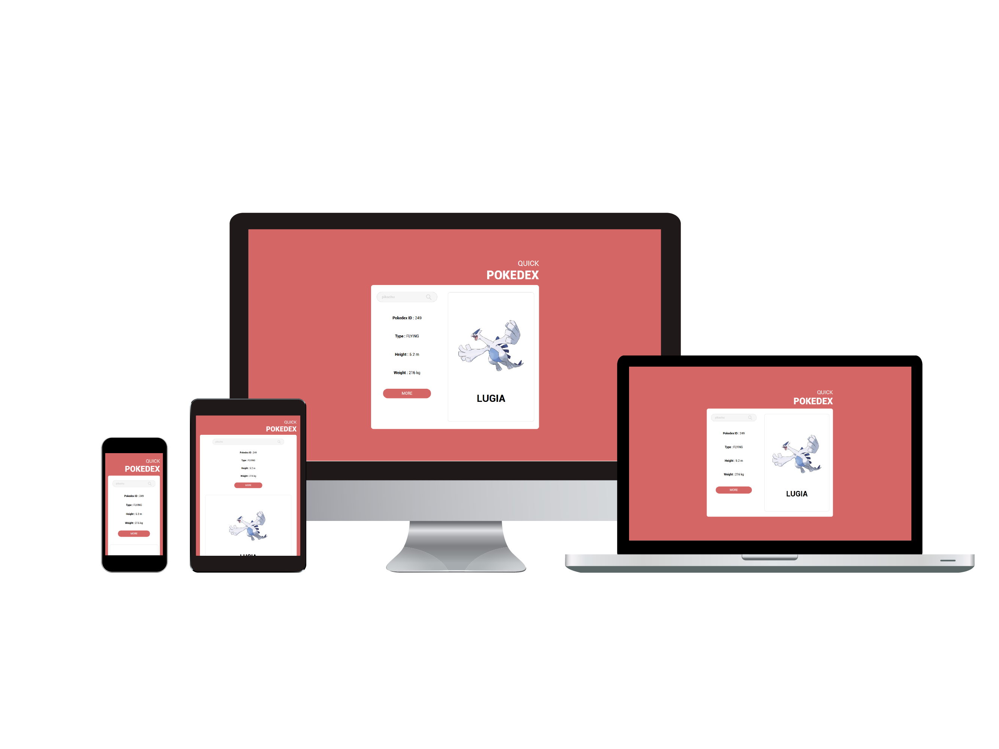

# Quick Pokedex
This is a quick and simple application that uses public api to showcase quick information on Pokemons.
There is a 'More' button that redirects users to the official pokedex application to view further information.

Link to Application : https://quickpokedex.netlify.com/

## Responsive
This application is fully responsive. I enjoyed making my own css structure so the application would be adjusted to any viewport.
Below are some screenshots of the final product.

